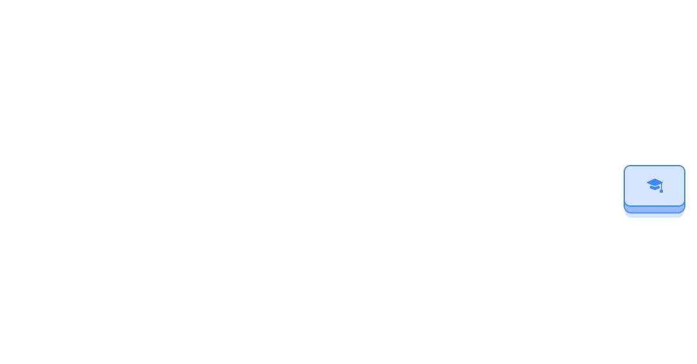
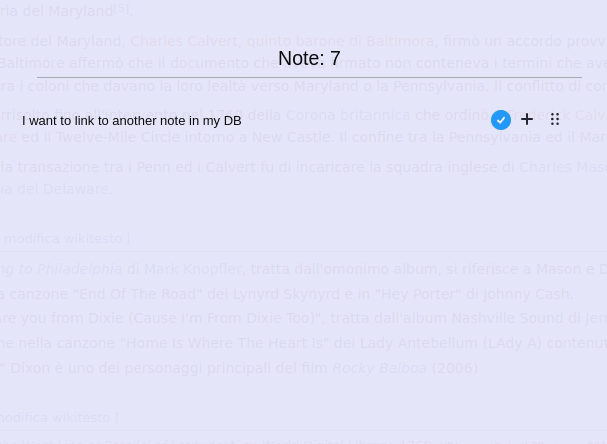
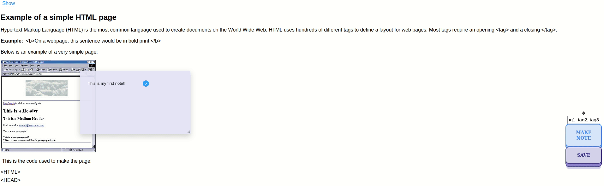

## WebResearcherJS (WBJS) 

Actively engage with webpages by annotating with WBJS sticky notes.


## Getting Started
- **WBJS Sticky Notes**: Download the WBJS Sticky Notes. Available on  [Firefox](https://addons.mozilla.org/en-US/firefox/addon/webresearcherjs/) and [Chrome (in beta)](https://chromewebstore.google.com/detail/webresearcherjs/gbddmghbmmnaioleipogfekanoahjeei?authuser=0&hl=en-GB). 

- **Local server**: All the notes taken on the browser using the extension will be saved to a server running locally. Requires node and npm.

```shell 
git clone https://github.com/kvgc153/WebResearcherJS-extension.git
cd WebResearcherJS-extension/wbjs-server/
npm install
node server.js
```
When the server successfully starts, you will get the following message:

```shell
Server is running on port 3000
Connected to the SQLite database.
Table created if it did not exist.
```
A sqlite DB will be created in the same folder which will contain all the notes taken by the webclipper. Check that this exists in the folder before procedding further.


## How to take notes using WBJS?



1. **Create a Note:** Click on the 'Make Note' button to start a note.

2. **Move Note:** Drag the note around the page by holding down the left mouse button and moving your mouse.

3. **Delete Note:** Right-click on the note, then select 'Delete' from the menu to remove it.

4. **Add tags:** Add relevant tags to your note for easy organization.   


5. **Search and link to your existing notes inline**:
   



6. **Saving notes**: Save notes to server by pressing the save button. The notes will be automatically displayed the next time you visit the page.



7. **View all notes** : Visit http://127.0.0.1:3000/notesViewer to view and search all the notes taken.

## Support and development
Checkout the notes posted [here](docs/docs.md) to understand how the extension code works and the notes posted [here](wbjs-server/README.md) to understand the server side implementation. Code, suggestions, and feedback are always welcome. 

The best way to support this project is by contributing to it if at all possible :). 

## Inspiration

WBJS has been inspired by the following note taking projects:

- [TiddlyWiki](https://tiddlywiki.com/)
- [Joplin](https://joplinapp.org/)
- [Logseq](https://github.com/logseq/logseq)
- [Promnesia](https://github.com/karlicoss/promnesia)

WBJS uses the following packages and is thankful to its developers for its continued maintainence 

- [JQuery](https://jquery.com/)
- [EditorJS](https://editorjs.io/)
- [Express.js](https://expressjs.com/)
