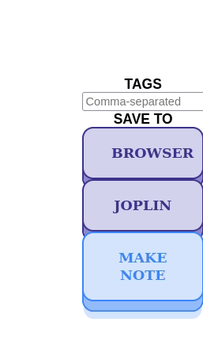

## WebResearcherJS (WBJS) 

Annotate your favorite webpages effortlessly and export to Joplin with ease using the WebResearcherJS Firefox extension. Download now from the add-on page ([https://addons.mozilla.org/en-US/firefox/addon/webresearcherjs/](https://addons.mozilla.org/en-US/firefox/addon/webresearcherjs/)) to supercharge your research and note-taking game.

## Getting Started

After installing the extension, the first step is to configure it to your specific needs. Checkout the notes posted [here](config.md) for details.

## How to take notes using WBJS?

1. **Create a Note:** Click on the 'Make Note' button to start a note.

2. **Move Note:** Drag the note around the page by holding down the left mouse button and moving your mouse.

3. **Delete Note:** Right-click on the note, then select 'Delete' from the menu to remove it.

4. **Add tags:** Add relevant tags to your note for easy organization.
   
   

By default, these notes and tags are automatically saved to your local storage and will be displayed the next time you visit the page. 

## Exporting Notes to Joplin

[Joplin](https://joplinapp.org/) is a great note taking tool and makes it easy to organize your notes.

1. Simply press the "Save to Joplin" button to export your current notes on the webpage to Joplin.
2. **Editing your notes/tags:** Want to make changes after exporting? Just click the "EDIT" button in your Joplin note. This will take you back to the original webpage for editing. Once done, save the updated note back to Joplin.

**See a quick demo below!** 

## Support and development
Checkout the notes posted [here](docs/docs.md) to understand how the source code works. Code, suggestions, and feedback are welcome.

