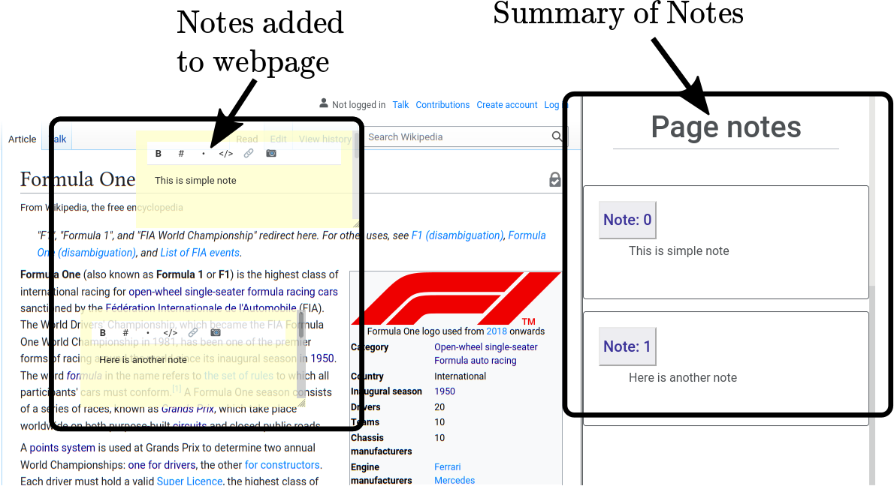
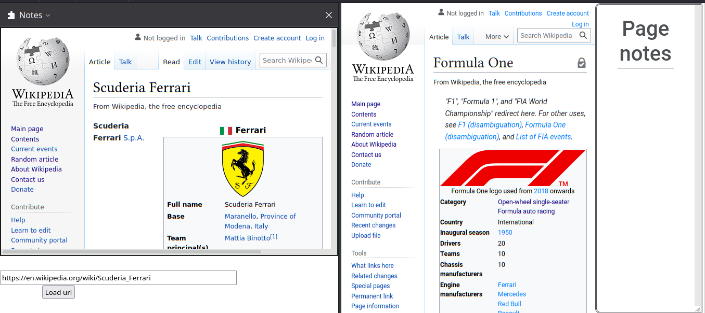
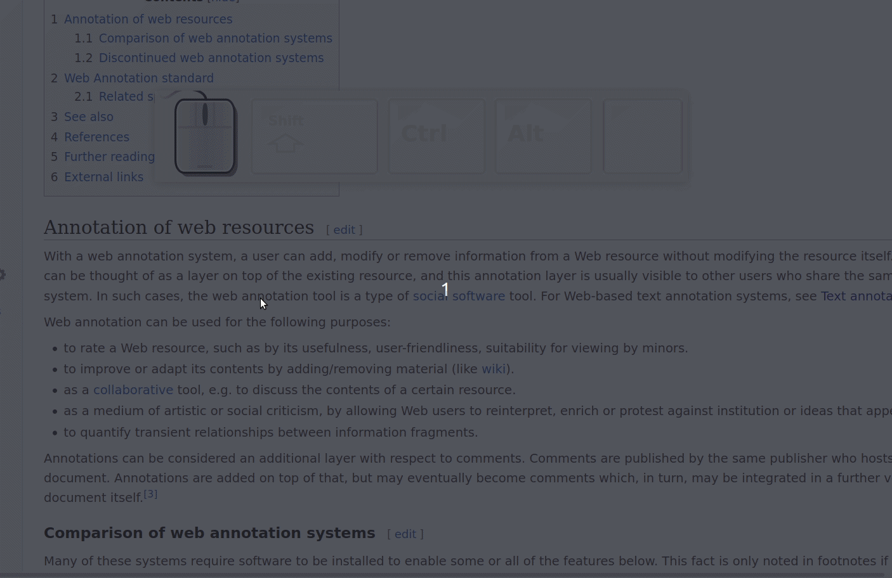

# WebResearcherJS-extension

> One of the challenges to using the internet as a means to learn is that, we oftentimes are unable to retain the information that we just read. But _maybe_ we would not run into this issue if there was a way to pro-actively engage in the content.

WebResearcherJS is a Firefox web extension which allows users to annotate webpages on the internet.

Try out the extension by downloading from the Firefox add-on page: https://addons.mozilla.org/en-US/firefox/addon/webresearcherjs/

### Features
Enable the extension on any webpage by opening the context menu (Right-mouse-click) and pressing 'Start WebResearcherJS'.

- Note taking.

- Sidebar with a custom URL loader

- Export notes to as Text, HTML or JSON.

### Video demo of features

https://youtu.be/ON_1rjPh_Ak.

### Usage

Select some text on the webpage (this acts as an anchor) and press Ctrl+1. This will create a note near the selected text. Hold down the shift key and drag the note across the webpage.

- **Ctrl + 1**: Create note near selection
  - Hold on the shift key and drag the note anywhere on the webpage
  - Resize as needed
  - Right click on any note to destroy it.
- **Ctrl + 2**: Save all annotations in current webpage to browser storage.
- **Ctrl + 3**: Load annotations from browser storage.
- **Ctrl + 7**: Green higlight box. (allows you to draw a rectangle around important elements on a webpage) 
  - Hold on the shift key and drag the box anywhere on the webpage
  - Resize as needed
  - Right click on box to destroy it.
- **Ctrl + 8**: Open 'Page notes' sidebar. This will display all the notes made in the page.
- **Ctrl + 9**: Close 'Page notes' sidebar.
- **Ctrl + 0**: Open Export note dialog box.
- **Ctrl + Alt + Y**: Open Sidebar.

#### Important: Always backup your browser storage!!
In order to prevent any data loss, always backup your browser's localStorage. This is typically stored in webappsstore.sqlite under your local firefox profile folder. Check out: [Where does Firefox store javascript/HTML localStorage?](https://stackoverflow.com/questions/7079075/where-does-firefox-store-javascript-html-localstorage).

### JS modules that this extension uses
- jQuery: https://jquery.com/
- jQuery-UI: https://jqueryui.com/
- Pell: https://github.com/jaredreich/pell
- Notify: https://notifyjs.jpillora.com/
- Bootstrap: https://getbootstrap.com/
