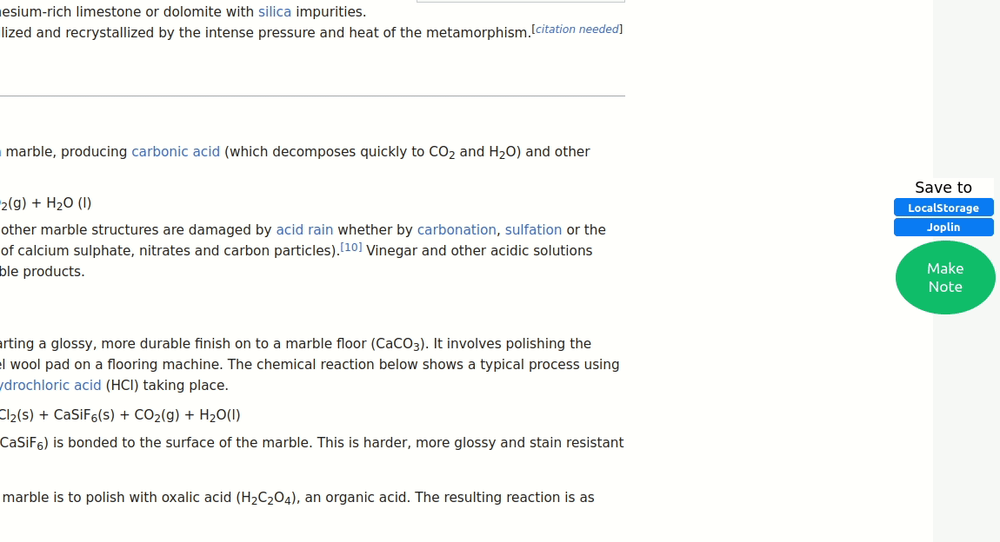
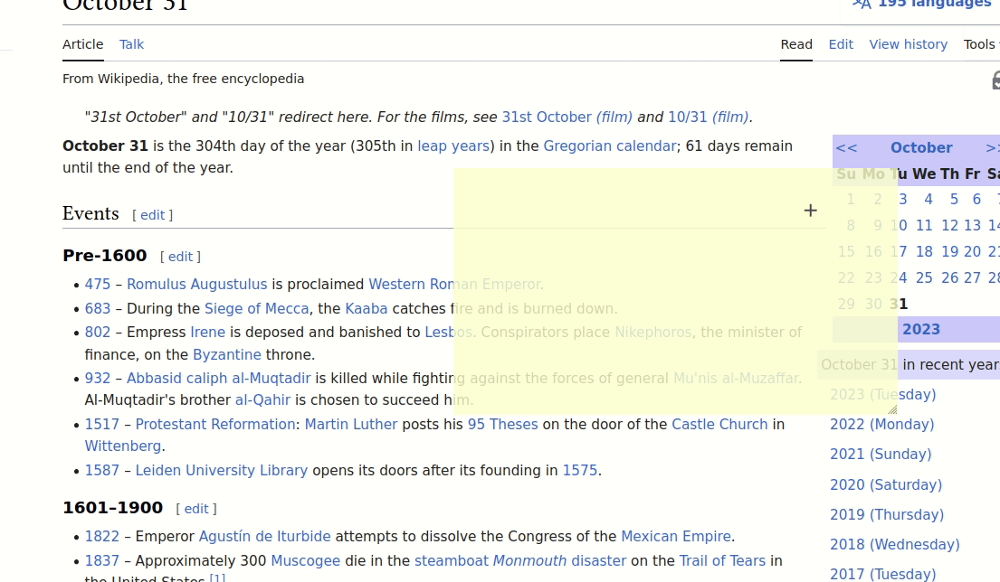
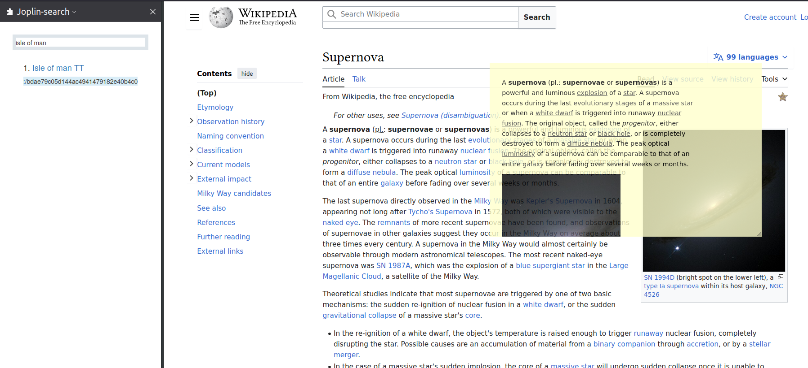

## WebResearcherJS

Annotate your favorite webpages effortlessly and export to Joplin with ease using the WebResearcherJS Firefox extension. Download now from the add-on page ([https://addons.mozilla.org/en-US/firefox/addon/webresearcherjs/](https://addons.mozilla.org/en-US/firefox/addon/webresearcherjs/)) to supercharge your research and note-taking game.

## Getting Started

After installing the extension, the first step is to configure it to your specific needs. Checkout the notes posted [here](config.md) for details.

## Core features
- Click on the 'make note' to start a note.

  - These notes are automatically saved to your local storage and will be displayed the next time you visit the page. 

### Integration with Joplin

- You can also export to them to Joplin by pressing the 'save to Joplin' button

- Add tags to the note that will be exported to Joplin  

- Want to make changes to the exported note? Just click on the 'EDIT' button in the exported note on Joplin to go back to the webpage and edit the note. Resave the updated note back to Joplin. See demo below:

## Experimental features
- **Contextual highlighting**: This feature will compare the text contained in the notes and the text displayed on the webpage, and if the two are in agreement, it will highlight them on the webpage. See demo below. You can enable this by setting the contextual highlighting to true when configuring the extension.

- **Joplin-search sidebar**: Search through your Joplin notes by using the Joplin-search sidebar. You can open/close this sidebar by pressing Ctrl+Alt+Y.

## Support and development
Checkout the notes posted [here](docs/docs.md) to understand how the source code works. Code, suggestions, and feedback are welcome.

