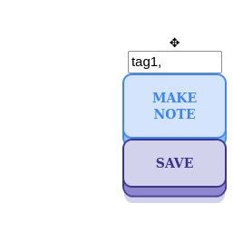

## WebResearcherJS (WBJS) 

Annotate your webpages effortlessly and export to [Joplin](https://joplinapp.org/) with ease using the WebResearcherJS Firefox extension.  

## Getting Started
Download the extension from the add-on page ([https://addons.mozilla.org/en-US/firefox/addon/webresearcherjs/](https://addons.mozilla.org/en-US/firefox/addon/webresearcherjs/)).

After installing, the first step is to configure it to your specific needs. Checkout the notes posted [here](config.md) for details.

## How to take notes using WBJS?

1. **Create a Note:** Click on the 'Make Note' button to start a note.

2. **Move Note:** Drag the note around the page by holding down the left mouse button and moving your mouse.

3. **Delete Note:** Right-click on the note, then select 'Delete' from the menu to remove it.

4. **Add tags:** Add relevant tags to your note for easy organization.
   
   

## Saving notes

By default, these notes and tags are periodically saved a database on your server and will be displayed the next time you visit the page. You can also manually save the notes to your notes at any time pressing the "Save" button to export your current notes on the webpage.

## Support and development
Checkout the notes posted [here](docs/docs.md) to understand how the source code works. Code, suggestions, and feedback are welcome. FAQs are posted [here](troubleshooting.md)

