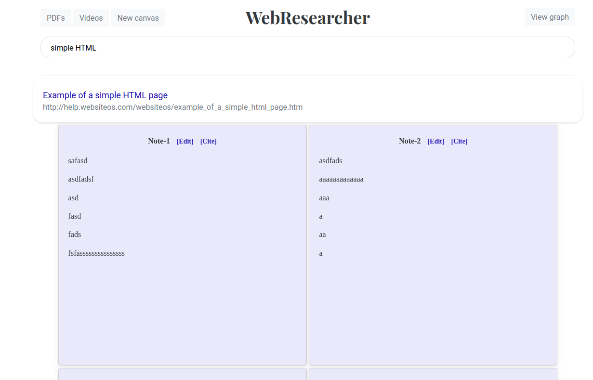

## WebResearcher-notes 


Sticky notes for the web.


## Getting Started
- Download the WBJS Sticky Notes extension. Available on [Firefox](https://addons.mozilla.org/en-US/firefox/addon/webresearcherjs/). 

- **Local server**: All the notes taken on the browser using the extension will be saved to a server running locally. 

```shell 
git clone https://github.com/kvgc153/WebResearcherJS-extension.git
cd WebResearcherJS-extension/wbjs-server/
npm install
```
- **Registering extension with server**: Visit `about:debugging#/runtime/this-firefox` and grab the Manifest URL of the WBJS Sticky Notes extension (starts with moz-extension://) and paste it in wbjs-server/registeredUsers.json. If you install the extension in multiple browsers, add the manifest URL of all the installed extensions.
  
Here's an example how one such registeredUses.json file would look like for two firefox instances:

```javascript
["moz-extension://03cc1dfa-xxxx-aaaa-qqqq-8d4435yy948d/","moz-extension://f8c42426-yyyy-zzzz-rrrr-17a1231ee6fa/"]
```

Start the server

```shell
node server.js
```
Multiple sqlite DBs will be created in the same folder which will contain all the notes taken by the extension. Check that this exists in the folder before proceeding further.


## How to take notes using WebResearcher-notes?


1. **Create a Note:** Navigate to your favorite webpage (here's an [example](https://en.wikipedia.org/wiki/Foobar)).Click on the 'Make Note' button to start a note.

2. **Move Note:** Drag the note around the page by holding down the left mouse button and moving your mouse.

3. **Add tags:** Add relevant tags to your note for easy organization.   


4. **Saving notes**: Save notes to server by pressing the save button (or Alt+S/Cmd+S). The notes will be automatically displayed the next time you visit the page.

5. **Link notes**: Link to existing notes.


5. **View all notes** : Visit http://127.0.0.1:3000/notesViewer to view and search all the notes taken.





The query string `q` can also be used to search the notes. 
Example usage: 
```
http://127.0.0.1:3000/notesViewer?q=test
```

Click [here](featuresAll.md) to learn about all the features of WBJS and [here](developerNotes.md) for developer notes.


 
# Buy me a Coffee :coffee:

If you like this project and would like to support this work, please consider [buying me a cup of coffee](https://buymeacoffee.com/509si1f).
