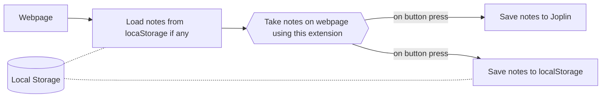
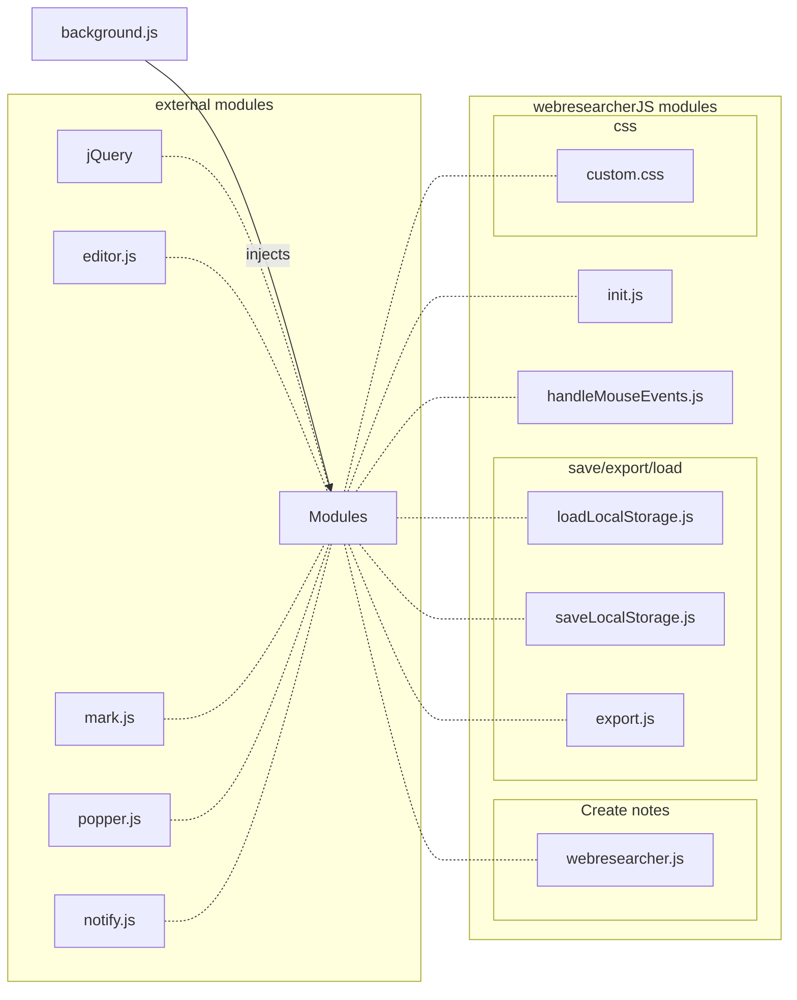

### Extension overview 

### Flowchart of source code

ext_libs/
> Contains all external libraries used in this extension

webresearcher/init.js
> Parameters controlling behavior of notes and highlights (e.g., color of note, fontsize, opacity, etc)

webresearcher/loadLocalStorage.js
> Checks if notes are available in localstorage and if so, loads them. autosave notes to localStorage every 15 seconds.

webresearcher/saveLocalStorage.js
> Save notes to localStorage when user clicks 'Save notes' button

webresearcher/export.js
> Export notes to Joplin.

webresearcher/webresearcher.js
> Core file containing class 'WBJS' which handles the creation of notes on the DOM when the user clicks Ctrl+1. 

webresearcher/custom.css
> css used for highlighting text on DOM
