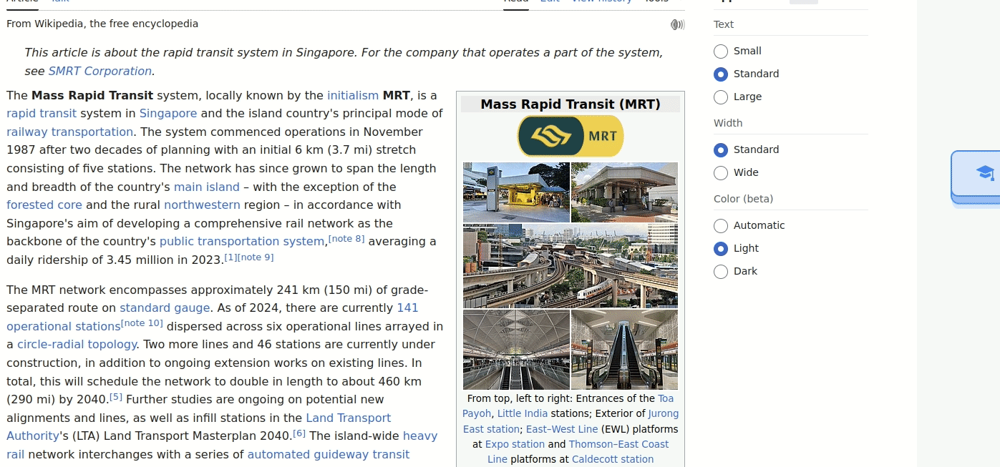
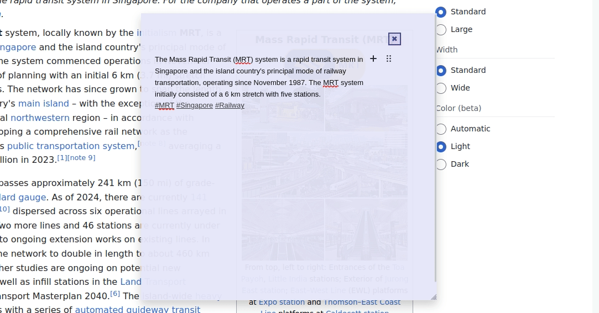

## Support for Llama3.2 (optional)

As of v8.0.0, WBJS offers the following features incorporating Meta's Llama 3.2 that the user can run locally using ollama (See [here](https://ollama.com/library/llama3.2) for instructions). The speed of the responses will depend on your available computing resources.

- **Summarize highlighted text :**

- **Continue having a conversation in the note** (For example, quiz yourself on your understanding). :

All the text in the note will be used as context and sent to the mode