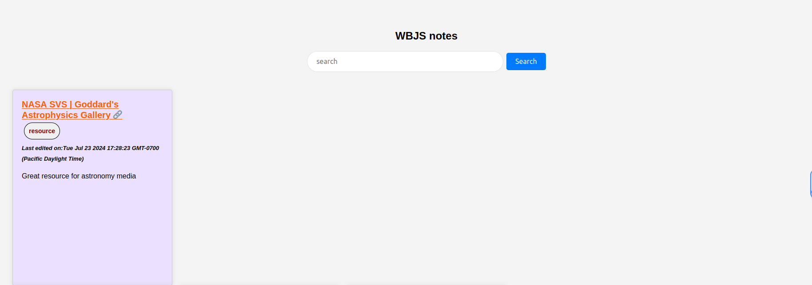
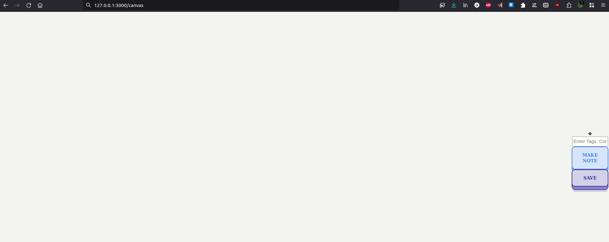

## Running the wbjs-server
```shell
npm install
node server.js
```

When the server successfully starts, you will get the following message:

```shell
Server   is   running   on   port   3000
Connected   to   the   SQLite   database.
Table   created   if   it   did   not   exist.
```

A sqlite DB will be created in the same folder which will contain all the notes taken by the webclipper. Check that this exists in the folder before procedding further.

### Pages
- /notesViewer --- Page containing all the notes taken with WBJS along with search. Visit http://127.0.0.1:3000/notesViewer




### Endpoints to server
- /getAll -- gets all the notes in the database. 
```javascript 
var dataPacket = {};
fetch(`http://127.0.0.1:3000/getAll`,
    {
        body: JSON.stringify(dataPacket),
        method: "POST",
        headers: {
        "Content-Type": "application/json",
        },
    }).then((results) => {
        results.json().then((data) => {
            console.log(data); // This data object contains all the notes
        })
    });
```

- /search -- search the database.
```javascript
var dataPacket = {};
dataPacket['key'] = "arxiv"; // search term -- here i am searching the database for notes containing 'arxiv'

fetch(`http://127.0.0.1:3000/search`,
{
    body: JSON.stringify(dataPacket),
    method: "POST",
    headers: {
    "Content-Type": "application/json",
    },
}).then((results) => {
    results.json().then((data) => {
         console.log(data);
    })
});


```

- /data -- Used to make new notes. Note that the datapacket needs to the format specified below for it be saved to the database. Caution: Make sure your keys are unique. The server does not enforce this by default.

```javascript
let dataToSave ={}
dataToSave['HTML']  = "";
dataToSave['JSON']  = "";
dataToSave['CSS']   = "";
dataToSave['TAGS']  = "";
dataToSave['TITLE'] = "";
dataToSave['URL']   = "";


var dataPacket = {};
dataPacket["insert_key_save_data"] = JSON.stringify(dataToSave);

fetch("http://127.0.0.1:3000/data",
{
    body: JSON.stringify(dataPacket),
    method: "POST",
    headers: {
      "Content-Type": "application/json",
    },          
}
);
```

- /canvas -- When a user visits this page, a unique html page is created and stored in the notes/ folder. Then the server redirects the user to the created page. The user can use the webclipper to take notes on this blank canvas page. Attached is a demo:



